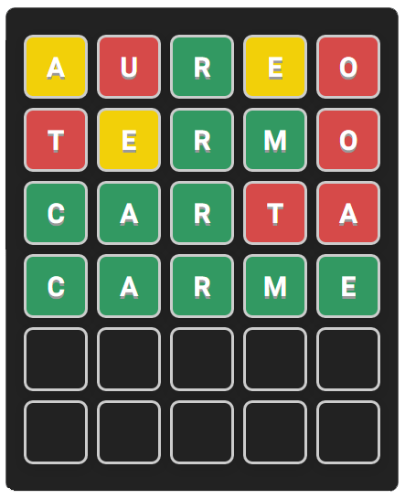

# O que é termo clone?
[Termo](https://term.ooo/) é uma adaptação do famoso jogo [Wordle do NY Times](https://www.nytimes.com/games/wordle/index.html) para o português brasileiro, desenvolvido Fernando Serboncini.
Este é um projeto de estudos da linguagem JavaScript ES6, HTML e CSS, todos os créditos vão para os criadores do Termo e do Wordle.
# Como funciona?
Este projeto funciona um pouco diferente dos originais, a cada vez que a página é carregada, uma palavra diferente é sorteada e o seu objetivo é acertá-la em 6 chances.
# Como jogar?
A cada rodada, você deve jogar uma palavra válida na lingua portuguesa, e assim você receberá dicas para acertar a palavra final.
## Letras Verdes:
As letras que ficarem verdes, significam que estão na palavra e na posição correta.
## Letras Amarelas:
As letras que ficarem amarelas, significam que estão na palavra, porém estão em outra posição.
## Letras Vermelhas:
As letras que ficarem vermelhas, não estão na palavra.
